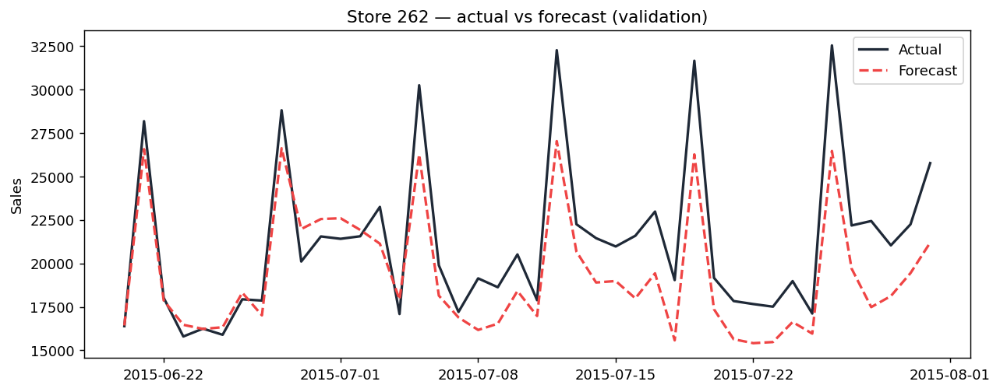
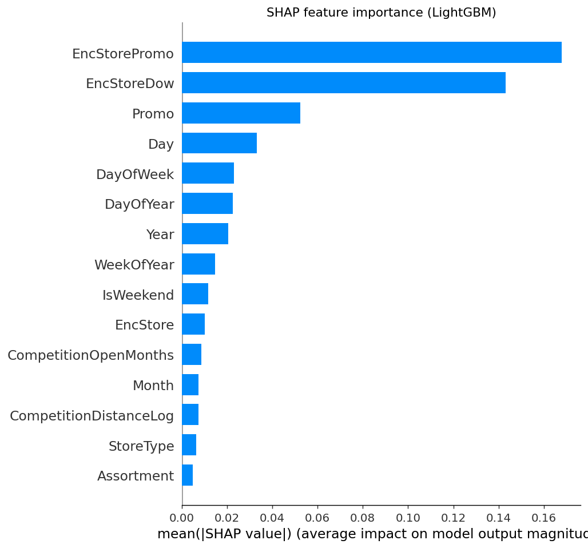
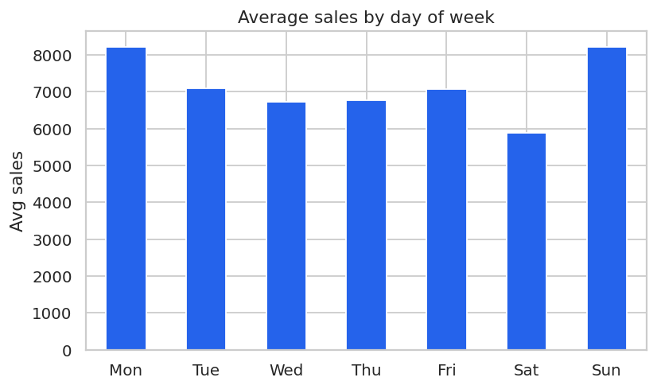

# 🏪 Rossmann Store Sales — Forecasting

**EN —** I built this to forecast daily sales for 1,115 Rossmann drugstores six weeks
ahead — the same setup as the Kaggle competition. What I cared about most wasn't a flashy
score, but doing it *honestly*: no data leakage, and a real baseline to prove the model
actually learns something.

**TR —** 1.115 Rossmann mağazasının günlük satışını 6 hafta öncesinden tahmin eden bir model
kurdum; kurulum Kaggle yarışmasındakiyle birebir aynı. Derdim yüksek bir skor tutturmak
değildi, işi düzgün yapmaktı: veri sızıntısına düşmeden, modelin gerçekten bir şey öğrenip
öğrenmediğini görebileceğim sağlam bir baseline ile kıyaslayarak.


---

## 📊 Results / Sonuçlar

**EN —** I evaluated everything on a time-based hold-out (the last 6 weeks), using RMSPE —
the competition metric. Here's where I landed:

**TR —** Her şeyi zamana göre ayırdığım bir hold-out'ta (son 6 hafta) ve yarışmanın metriği
olan RMSPE üzerinden ölçtüm. Sonuçlar şöyle:

| Model | RMSPE | RMSE | MAE |
|-------|:-----:|:----:|:---:|
| Baseline (store × day-of-week median) | 0.245 | 1,696 | 1,259 |
| LightGBM (hand-set params) | 0.128 | 898 | 609 |
| **LightGBM + Optuna** | **0.124** | **871** | **591** |

**EN —** My tuned model roughly halves the baseline error, and the tuning itself shaved a
bit more off (0.128 → 0.124). Because it clearly beats a strong naive baseline, I trust that
it's learning real structure rather than echoing the average. For reference, good single
models in the Kaggle competition scored around 0.11–0.13.

**TR —** Ayarladığım model baseline hatasını neredeyse yarıya indiriyor; tuning'in kendisi de
skoru biraz daha çekti (0.128 → 0.124). Naif baseline'ı bu kadar geride bıraktığına göre model
sadece ortalamayı tekrarlamıyor, verideki asıl örüntüyü yakalıyor. Kıyas olsun diye: yarışmada
iyi sayılan tek modeller 0.11-0.13 bandındaydı.

<p align="center">
  
</p>
<p align="center">
  
  
</p>

## 🧠 The two decisions I'm most proud of / En çok gurur duyduğum iki karar

### 1. No leakage / Sızıntı yok

**EN —** The real task predicts six weeks with *no recent sales available*, so I couldn't
use yesterday's or last week's sales as features — that would be leakage. Instead I leaned on
things I'd actually know in advance (calendar, promos, holidays, store metadata) plus
historical aggregates that I fit **only on the training split** (a store's typical sales by
weekday, and under promo vs not). It's the honest way to give the model store history without
cheating.

**TR —** İşin özü şu: elimde yakın tarihli satış verisi olmadan 6 hafta ileriyi tahmin etmem
gerekiyor. Yani dünün ya da geçen haftanın satışını feature olarak kullanmak yasak, kullansam
sızıntı olurdu. Onun yerine tahmin anında zaten bileceğim şeylere dayandım (takvim, promosyon,
tatil, mağaza bilgileri); bir de **sadece eğitim verisinden** çıkardığım geçmiş ortalamalara
(mağazanın gün gün, promosyonlu ve promosyonsuz tipik satışı). Modele geçmişini hile yapmadan
öğretmenin dürüst yolu bu.

### 2. Tuning without peeking / Peeking'siz tuning

**EN —** When I tuned with Optuna, I refused to look at the final validation window. I tuned
on the 6 weeks *before* it, and I even picked the number of trees using a separate inner
split — so the real hold-out stayed untouched until the single final measurement. That's why
I believe the 0.124 is a fair number and not a lucky fit.

**TR —** Optuna ile tuning yaparken asıl validasyon penceresine hiç bakmadım. Ondan bir önceki
6 hafta üzerinde tune ettim, ağaç sayısını bile ayrı bir iç bölmeyle belirledim; böylece gerçek
hold-out, en sondaki tek ölçüme kadar hiç el değmeden durdu. 0.124'ün şans eseri denk gelmiş
değil, hakkıyla çıkmış bir sayı olduğuna bu yüzden güveniyorum.

## 🔑 What the data told me / Verinin bana söyledikleri

**EN / TR:**
- **Promotions really move sales — about +39%.** / **Promosyon satışı ciddi biçimde artırıyor: yaklaşık +%39.**
- **There's a strong weekly rhythm** (Monday & Sunday high, Saturday low). / **Belirgin bir haftalık ritim var** (Pazartesi ve Pazar yüksek, Cumartesi düşük).
- **December peaks** ~24% above an average month. / **Aralık ayı zirve yapıyor**, ortalama bir aya göre ~%24 yukarıda.
- **A store's own history is the best predictor** — it dominates the SHAP importance. / **En iyi tahmin edici, mağazanın kendi geçmişi**; SHAP önem grafiğine de açık ara o hakim.

## 🗂️ Project structure / Proje yapısı

```
rossmann-sales-forecast/
├── data/raw/{train.csv, store.csv}
├── notebooks/01_sales_forecast.ipynb   # the full story end to end
├── src/
│   ├── config.py        # paths, split, tuned params
│   ├── data.py          # load + merge + clean
│   ├── features.py      # calendar/store features + leakage-safe encodings
│   ├── model.py         # baseline + LightGBM (log-target)
│   ├── tune.py          # Optuna search (no-peeking, resumable)
│   ├── evaluate.py      # RMSPE / RMSE / MAE + plots
│   ├── eda.py           # EDA figures
│   └── explain.py       # SHAP
├── train.py             # end-to-end pipeline
├── requirements.txt
└── README.md
```

## 🚀 Getting started / Başlangıç

```bash
git clone https://github.com/derinteke/rossmann-sales-forecast.git
cd rossmann-sales-forecast

python -m venv venv
source venv/bin/activate            # Windows: venv\Scripts\activate
pip install -r requirements.txt

python train.py                     # train + evaluate
python -m src.tune --trials 15      # reproduce/extend the Optuna search
python -m src.eda                   # EDA figures
python -m src.explain               # SHAP figure
jupyter notebook notebooks/01_sales_forecast.ipynb
```

## 🔭 Where I'd take it next / Bundan sonrası

**EN —** I'd add per-store prediction intervals (quantile LightGBM) so the forecast comes
with a confidence band, and I'd wrap the model in a small FastAPI + Streamlit app so someone
could actually pull up a store and see its six-week outlook.

**TR —** Sırada ne var dersen: mağaza bazında tahmin aralıkları (quantile LightGBM) eklerdim ki
her tahmin bir güven bandıyla gelsin. Bir de modeli küçük bir FastAPI + Streamlit uygulamasına
sarıp, birinin gerçekten bir mağaza seçip 6 haftalık gidişatını görebilmesini sağlardım.

## 📚 Data / Veri

**EN —** Rossmann Store Sales (Kaggle): daily sales for 1,115 German drugstores,
Jan 2013 – Jul 2015, with promo, holiday and competition metadata.

**TR —** Rossmann Store Sales (Kaggle): 1.115 Alman mağazasının Oca 2013 – Tem 2015 arası
günlük satışları; promosyon, tatil ve rakip bilgileriyle birlikte.

## 📄 License

MIT.
